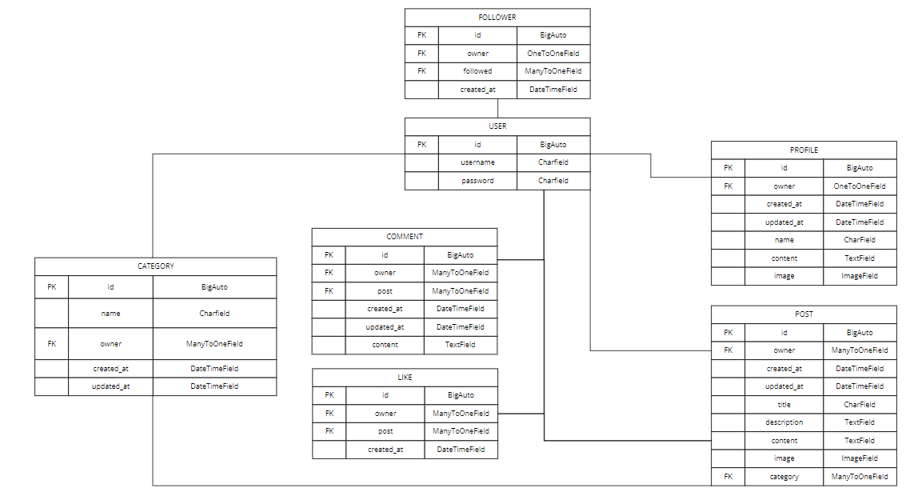

# Stories

## Project goals

This project provides a Django Rest Framework API for the [Stories of the World React web app](https://github.com/ellikarg/firsteverfrontend/blob/main/README.md). Stories of the World is a social media platform designed to share stories of any kind: invented stories, stories a user experienced while traveling, myths that the user listened to in her own or in another country, legends about historical characters or childrens' stories - and all of them from all around the world.   The real focus is on the text instead of the images like on other social media platforms, however, for aestetic purposes, each story is accompanied by any kind of image (photo/drawing/etc.). Users will be able to like a story, to look at all stories from one specific storyteller and to follow a storyteller they especially like. Also they will be able to comment on stories from other storytellers.

## Table of contents
- [Stories](#stories)
  * [Project goals](#project-goals)
  * [Table of contents](#table-of-contents)
  * [Planning](#planning)
    + [Data models](#data-models)
  * [API endpoints](#api-endpoints)
  * [Frameworks, libraries and dependencies](#frameworks-libraries-and-dependencies)
    + [django-cloudinary-storage](#django-cloudinary-storage)
    + [dj-rest-auth](#dj-rest-auth)
    + [dj-database-url](#dj-database-url)
    + [psychopg2](#psychopg2)
    + [django-filter](#django-filter)
    + [django-cors-headers](#django-cors-headers)
  * [Testing](#testing)
    + [Manual testing](#manual-testing)
    + [Python validation](#python-validation)
    + [Resolved bugs](#resolved-bugs)
      - [Bugs found while testing the API in isolation](#bugs-found-while-testing-the-api-in-isolation)
      - [Bugs found while testing the React front-end](#bugs-found-while-testing-the-react-front-end)
    + [Unresolved bugs](#unresolved-bugs)
  * [Deployment](#deployment)
  * [Credits](#credits)

<small><i><a href='http://ecotrust-canada.github.io/markdown-toc/'>Table of contents generated with markdown-toc</a></i></small>

## Planning

Planning started by creating epics and user stories for the frontend application, based on the project goals. The user stories were used to map out the intended functionality and develop a first wireframe. See the [repo for the frontend React app](https://github.com/ellikarg/firsteverfrontend/blob/main/README.md) for more details.

### Data models

The logic of the project uses 7 models, that are connected with each other. An overview of the models and their relation to each other can be found in the diagram below.

Data Models

## API endpoints
| **URL** | **User Story** | **HTTP Method** | **CRUD operation** |
|---|---|---|---|
| /posts/create | as a user I can create a post | POST | create |
| /posts/int:pk | as a user I can view a story | GET | list |
| /posts/int:pk/edit | as a user I can edit my story | PUT | update |
| /posts/int:pk/delete | as a user I can delete my story | DELETE | destroy |
| /profiles/int:pk | as a user I can view a profile | GET | list |
| /profiles/int:pk/edit | as a user I can edit my profile | PUT | update |
| /profiles/int:pk/edit/username | as a user I can edit my username | PUT | update |
| /profiles/int:pk/edit/password | as a user I can change my password | PUT | update |
| /profiles/int:pk/delete | as a developer (admin user) I can delete a profile | DELETE | destroy |
| /comments | as a developer I can view all comments | GET | list |
| /likes | as a developer I can view all likes | GET | list |
| /followers | as a developer I can view which profile is following who | GET | list |
| /categories | as a developer I can view all categories | GET | list |
| /categories/category/int:pk/change/ | as a developer I can update a category | PUT | update |
| /categories/category/int:pk/delete/ | as a developer I can delete a category | DELETE | destroy 

## Frameworks, libraries and dependencies

### django-cloudinary-storage

https://pypi.org/project/django-cloudinary-storage/
Enables cloudinary integration for storing user profile images in cloudinary.

### dj-rest-auth

https://dj-rest-auth.readthedocs.io/en/latest/introduction.html
Provides REST API endpoints for registration, login and logout.

### dj-database-url

https://pypi.org/project/dj-database-url/
Creates an environment variable to configure the connection to the database.

### psychopg2

https://pypi.org/project/psycopg2/
Database adapater to enable interaction between Python and the PostgreSQL database.

### django-filter

https://django-filter.readthedocs.io/en/stable/
django-filter is used to implement filtering for all stories (posts) of a certain storyteller (user) and all stories a user liked.

### django-cors-headers

https://pypi.org/project/django-cors-headers/
This Django app adds Cross-Origin-Resource Sharing (CORS) headers to responses, to enable the API to respond to requests from origins other than its own host.

## Testing

### Manual testing

### Python validation

The validation was undertaken with the [PEP8 Validator of CodeInstitute](https://pep8ci.herokuapp.com/) for each file with the following results:
  
CATEGORIES APP:  
`admin.py` -> All clear, no errors found 
`models.py`  -> All clear, no errors found 
`serializers.py`  -> All clear, no errors found 
`urls.py`  -> All clear, no errors found 
`views.py`  -> All clear, no errors found 
  
COMMENTS APP:  
`models.py`  -> All clear, no errors found 
`serializers.py`  -> All clear, no errors found 
`urls.py`  -> All clear, no errors found 
`views.py`  -> All clear, no errors found 
  
FIRSTEVERBACKEND APP:  
`permissions.py`  -> All clear, no errors found 
`serializers.py`  -> All clear, no errors found 
`settings.py`  -> All clear, no errors found (although # noqa was used when it did not make sence to break the line) 
`urls.py`  -> All clear, no errors found 
`views.py`  -> All clear, no errors found 
`wsgi.py`  -> All clear, no errors found 
  
FOLLOWERS APP:  
`apps.py`  -> All clear, no errors found 
`models.py`  -> All clear, no errors found 
`serializers.py`  -> All clear, no errors found 
`urls.py`  -> All clear, no errors found 
`views.py`  -> All clear, no errors found 
  
LIKES APP:  
`apps.py`  -> All clear, no errors found 
`models.py`  -> All clear, no errors found 
`serializers.py`  -> All clear, no errors found 
`urls.py`  -> All clear, no errors found 
`views.py`  -> All clear, no errors found 
  
POSTS APP:  
`admin.py`  -> All clear, no errors found 
`apps.py`  -> All clear, no errors found 
`models.py`  -> All clear, no errors found 
`serializers.py`  -> All clear, no errors found 
`urls.py`  -> All clear, no errors found 
`views.py`  -> All clear, no errors found 
  
LIKES APP:  
`admin.py`  -> All clear, no errors found 
`apps.py`  -> All clear, no errors found 
`models.py`  -> All clear, no errors found 
`serializers.py`  -> All clear, no errors found 
`urls.py`  -> All clear, no errors found 
`views.py`  -> All clear, no errors found 
  
`env.py`  -> All clear, no errors found (although # noqa was used when it did not make sence to break the line)
  

### Resolved bugs

#### Bugs found while testing the API in isolation

No bigger bugs found worth mentioning.

#### Bugs found while testing the React front-end

The bugs found while testing the React front-end can be found in this [README](https://github.com/ellikarg/firsteverfrontend/blob/main/README.md#resolved-bugs).

### Unresolved bugs

No bugs known.

## Deployment
The Stories of the World API is deployed to Heroku, using an ElephantSQL Postgres database.
To duplicate deployment to Heroku, follow these steps:

- Fork or clone this repository in GitHub.
- You will need a Cloudinary account to host user profile images.
- Login to Cloudinary.
- Select the 'dashboard' option.
- Copy the value of the 'API Environment variable' from the part starting `cloudinary://` to the end. You may need to select the eye icon to view the full environment variable. Paste this value somewhere for safe keeping as you will need it shortly (but destroy after deployment).
- Log in to Heroku.
- Select 'Create new app' from the 'New' menu at the top right.
- Enter a name for the app and select the appropriate region.
- Select 'Create app'.
- Select 'Settings' from the menu at the top.
- Login to ElephantSQL.
- Click 'Create new instance' on the dashboard.
- Name the 'plan' and select the 'Tiny Turtle (free)' plan.
- Select 'select region'.
- Choose the nearest data centre to your location.
- Click 'Review'.
- Go to the ElephantSQL dashboard and click on the 'database instance name' for this project.
- Copy the ElephantSQL database URL to your clipboard (this starts with `postgres://`).
- Return to the Heroku dashboard.
- Select the 'settings' tab.
- Locate the 'reveal config vars' link and select.
- Enter the following config var names and values:
    - `CLOUDINARY_URL`: *your cloudinary URL as obtained above*
    - `DATABASE_URL`: *your ElephantSQL postgres database URL as obtained above*
    - `SECRET_KEY`: *your secret key*
    - `ALLOWED_HOST`: *the url of your Heroku app (but without the `https://` prefix)*
- Select the 'Deploy' tab at the top.
- Select 'GitHub' from the deployment options and confirm you wish to deploy using GitHub. You may be asked to enter your GitHub password.
- Find the 'Connect to GitHub' section and use the search box to locate your repo.
- Select 'Connect' when found.
- Optionally choose the main branch under 'Automatic Deploys' and select 'Enable Automatic Deploys' if you wish your deployed API to be automatically redeployed every time you push changes to GitHub.
- Find the 'Manual Deploy' section, choose 'main' as the branch to deploy and select 'Deploy Branch'.
- Your API will shortly be deployed and you will be given a link to the deployed site when the process is complete.

## Credits

- basic structure inspired by the drf api walkthrough project of CodeInstitute
- Setting up the category model: [LogRocket Article](https://blog.logrocket.com/use-django-rest-framework-to-build-a-blog/)
